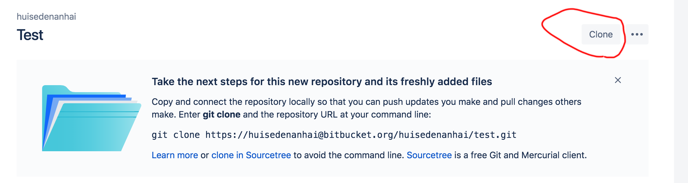

# Bitbucket使用说明

## 第一步 安装git

google一下各自的系统如何安装git，安装完成并且配置正确以后，打开命令行输入

```bash
git --version
```

应当可以看到git的版本信息，比如：

```
git version 2.18.0
```

有一些系统可能已经预先装好了git，可以先打开命令行试试。

> Mac用户推荐使用HomeBrew
>
> 打开命令行，输入
> ```bash
> brew --version
> ```
> 查看`brew`是否正确安装，如果没有，遵循[HomeBrew官网](https://brew.sh/)的指示安装.
>
> 安装成功以后，输入
> ```bash
> brew install git
> ```
> 等待安装成功

## 第二步 把仓库克隆到本地

可以把`bitbucket`当成一个高级网盘。要写作业，首先得把作业对应的仓库下载下来。

**首先，`cd`到你做作业的路径下**

在`bitbucket`页面中打开做作业用的仓库（以学号命名的那个），点击右上角`clone`按钮。



**把弹出来的链接复制到命令行里。回车以后，开始下载。第一次`clone`时候可能需要输入`bitbucket`的用户密码。**

复制完成，工作路径下应该多出了一个和仓库同名的文件夹。现在可以开始做作业了。

## 第三步 做作业

**首先，`cd`到刚刚下载好的仓库的路径下**

<del>然后做作业就对了</del>

你可以在这个本地路径里做任何你想要的改动。做作业，写代码,写小说，<del>装游戏</del>，whatever.

> 不要在里面放太大的文件，因为bitbucket可能有存储空间限制

> git命令行工具对中文路径的支持不是很好，尽量不要用中文文件名

作为测试，你可以随手新建一个文件，然后进行下面的步骤

## 第四步 交作业

在交作业前，你需要向`git`确认（`commit`）你所做的改动。但在这之前，我们先看看自己都干了啥

在命令行输入
```bash
git status
```

这会输出距离你上一次`commit`所做的改动。

不一定所有的改动你都想交上去，你需要手动指定需要提交的文件

```bash
git add 需要提交的发生改动的文件或文件夹
```

比如你改了`README.md`，那就

```bash
git add README.md
```

一个个加太麻烦了，用下面的命令把所有的改动都加进去

```bash
git add *
```

> `git add *`往往需要配合`.gitignore`文件使用。你可以在`.gitignore`文件中写上希望`git`无视的文件或文件夹，这样这些文件夹的改动就不会被`git`跟踪。

加完了需要提交的改动，可以用`git status`查看当前仓库的状态。一般黄色的是等待提交的内容，红色的是没有被加入的变动。具体请看`git status`说了什么。

指定完需要提交的变化之后，就可以确认（`commit`）了。

```bash
git commit -m '用简洁精炼的语言描述所做的改动'
```

> `-m`表示`commit`对应的信息。这是必填项。对于`commit`的描述需要简洁明了，不然会显得很不专业。

很好，我们确认了所有做过的改动，现在可以把本地内容推送（`push`）到`bitbucket`上。

直接在命令行输入如下命令即可

```bash
git push
```

这条命令会把本地`commit`过的文件同步到`bitbucket`上。

登录`bitbucket`网页检查一下，确认无误以后就算提交完成。

之后的作业只需要重复步骤三四即可。

## 作业目录要求

每次作业都放在独立的目录下，每个作业文件夹里都需要有一个对应的`README.md`文件

比如

```
17000xxxxx
-- hw1
---- README.md
-- hw2
---- README.md
```

其他辅助文件随意。

> 更多`git`使用请看[ref.md](../ref.md)
