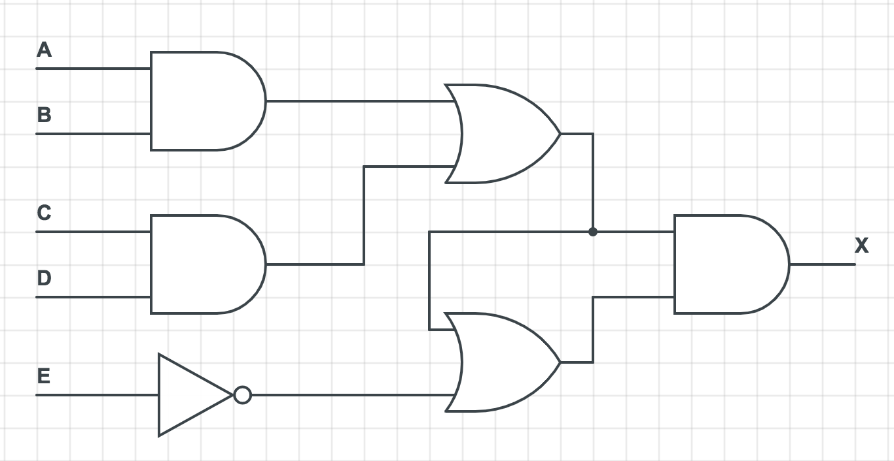

# 讲义2018-10-25

Author: 吕栋杰(huisedenanhai)

+ 记忆内容
    + P266 图4-18
    + P267 图4-19
    + P268 图4-20
    + P270 图4-21
    + 上面这些背下来之后后面的电路单元和HCL会更好背
    + P277 4.3.4 SEQ阶段的实现（电路和HCL）
        + HCL挖空要会填
    + 后面的电路之后再提

+ **大小端** 声明`short a[4]`。`gdb`中运行指令`x/8xb &a`得到如下结果
```
0x601030 <a>:    0xaf    0xff    0xff    0x3f    0x27    0xfa    0x3f    0x77
```
1. 若机器使用大端法，求数组`a`中元素从小到大排序后得到的输出。
2. 若机器使用小端法，求数组`a`中元素从小到大排序后得到的输出。

<!--
大端法高位放低地址，小端法高位放高地址（注意正负号）
1. `0xff3f 0x27fa 0x3f77 0xafff`
2. `0xfa27 0xffaf 0x3fff 0x773f`
-->

+ **关于寄存器** 这部分不是考点，但是对于理解之后的处理器电路非常重要，这里只讲课本里会用到的情况
    + 只有在时钟上升沿到来的时候寄存器才会更新自己的值
    + 同步清零：清零操作只发生在
        + 清零端信号有效
        + 时钟上升沿
+ **电路记号** 看下面的电路图，写出X对应的HCL

+ **不考算我输** 下面哪些话是对RISC的描述，哪些话是对CISC的描述
    + 指令数量多
    + 可以对内存和寄存器操作数进行算数和逻辑运算
    + 实现细节可见
    + 没有条件码，测试结果放在寄存器
    + 有条件码
    + 可以用栈存取过程参数，**用栈存返回地址**
    + 取址方式多样
    + 用**寄存器**存取过程参数和**返回地址**，有些过程能完全避免内存引用；通常会有很多寄存器（最多有32个）
    + 实现细节不可见
    + 单条指令延迟很短
    + 指令定长
    + 简单寻址方式，单独的load/store指令
    + 指令数量少
    + 单条指令延迟可能很长
    + 只能对寄存器操作数进行算数和逻辑运算

<!--
+ CISC vs RISC
    + CISC（x86-64）
        + 指令数量多
        + 单条指令延迟可能很长
        + 取址方式多样
        + 可以对内存和寄存器操作数进行算数和逻辑运算
        + 实现细节不可见
        + 有条件码
        + 可以用栈存取过程参数，**用栈存返回地址**
    + RISC
        + 指令数量少
        + 单条指令延迟很短
        + 指令定长
        + 简单寻址方式，单独的load/store指令
        + 只能对寄存器操作数进行算数和逻辑运算
        + 实现细节可见
        + 没有条件码，测试结果放在寄存器
        + 用**寄存器**存取过程参数和**返回地址**，有些过程能完全避免内存引用；通常会有很多寄存器（最多有32个）
-->

+ 看个[汇编大题](./c3-3(procedure).docx)
